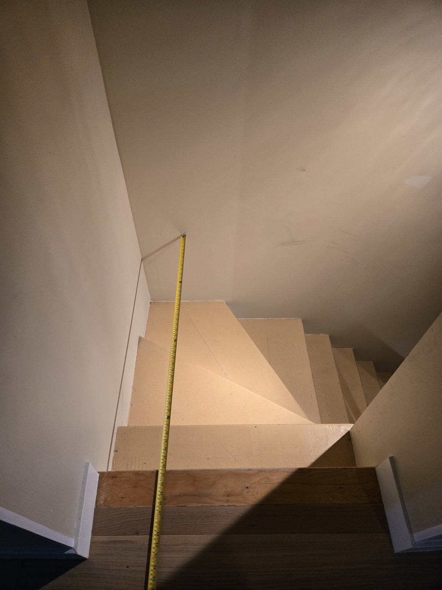
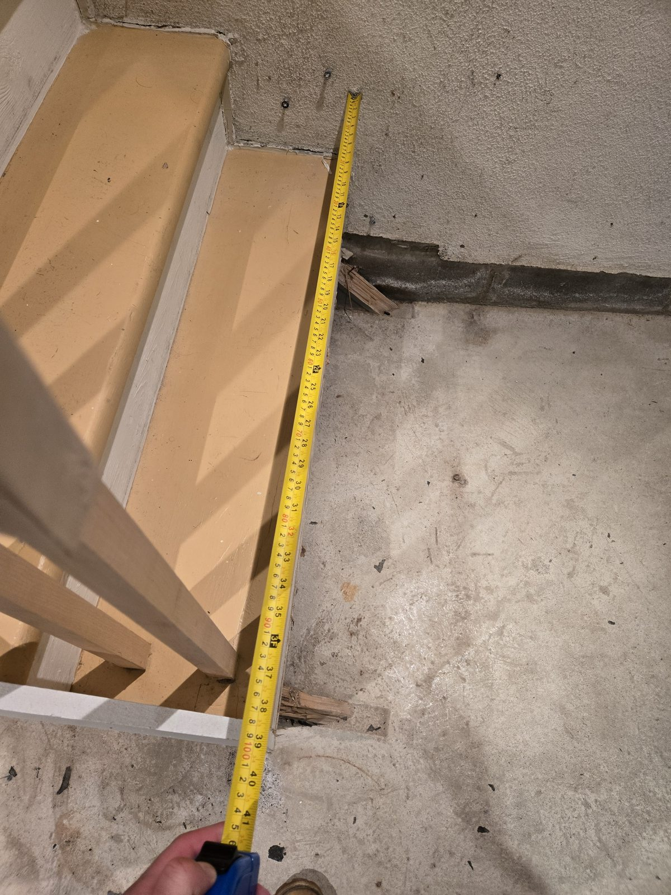
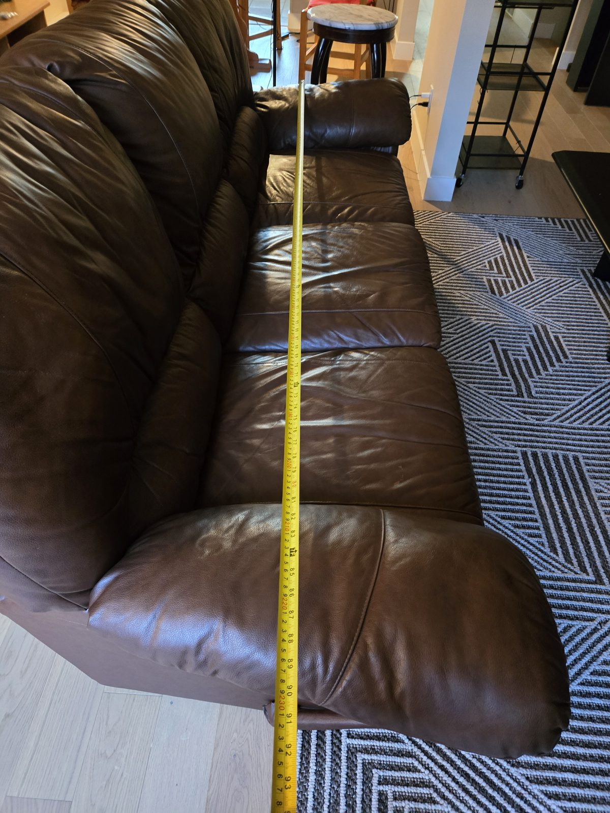

# Elbow Room

**Before you buy the couch, find out whether it can get up the stairs.**

Live: **https://elbow-room-sand.vercel.app**

Every room planner ever built answers *does it fit in the room*. This one answers the question that
actually costs people money and plaster: **can it even get there.** Through the door, up the run,
around the turn.



---

## Why this exists

I could not get a couch up the basement stairs. It stopped dead at the turn and would not go round,
whichever way I tipped it. It came out in the end, and it took some of the wall with it.

The stairs are in a 1970s house, and the flight turns through 90 degrees on
three winder treads. Pie-shaped steps, no landing, nowhere to stand the thing up and swing it.

Then it happened to someone else. A flood in July 2026 forced a water-heater replacement, and the
installers brought a 279 litre tank down the same stairs without putting anything on the walls
first. The gouges along the soffit edge in `docs/damage-soffit.jpg` are theirs, not the couch's.

Two objects. One staircase. Nobody measured it either time, and there was nowhere to look it up:

> The Centris listing for this property gives all thirteen rooms to the inch and says **nothing**
> about the stairs. The one measurement that decides whether your furniture can get in appears on no
> listing, no floor plan, and no furniture product page.

So I measured it.

| | |
|---|---|
| Clear width of the run | **3 ft 5½ in**, wall to stringer |
| The couch | **7 ft 7 in** arm to arm |
| Longest thing that gets round the turn at that depth | **3 ft 9½ in** |

The couch was more than twice the longest object that corner will ever pass. There was no angle, no
technique and no number of people that was going to work.

 

---

## What it does

A plan view of the turn, on canvas. Drag the couch, scroll to rotate, watch it go red where it jams.
Or ask your agent, and watch it do the same thing while you sit there.

The geometry underneath is the rectangle form of the classic **ladder-around-a-corner** problem. For
an object of width `w` passing between corridors of clear width `a` and `b`, the length that just
touches both outer walls and the inner corner at angle `t` is

```
L(t) = a/sin(t) + b/cos(t) − w/(sin(t)·cos(t))
```

The object fits only if it is shorter than the **minimum** of that curve, because it has to survive
every angle on the way round. That minimum sits nowhere near either extreme, which is exactly why
nobody can eyeball a winder turn, and why two sets of people wrecked the same wall.

On top of that: choosing which cross-section goes flat and which stands vertical (you turn a
mattress on its side), and how far you can tilt before the soffit stops you.

Verified against the closed form: a zero-width rod through two 41.5 in corridors gives 117.38 in,
which is 2^1.5 × 41.5, pinching at 45 degrees.

---

## Does it actually work? Two objects say yes

The staircase has history, and the history was recorded before this software existed. Dimensions
come from a tape and from the manufacturer's own engineering sheet, not from me.

| Object | Source of dimensions | Predicted | What actually happened | |
|---|---|---|---|---|
| The couch | measured, 91 × 36 in | **does not go** | did not go, wall damaged | hit |
| Giant 172E-3F8M water heater, 279 L | manufacturer submittal sheet, 24 in dia × 59⅞ in | **goes** | went down, soffit gouged | hit |

Two for two on the binary question. And the second row taught the app something: the tank cleared
in plan with **3 ft 9½ in to spare** and *still* gouged the soffit. Fitting and fitting without
touching anything are different answers, so under a foot of margin the verdict now says so.

The damage also locates the constraint the model is weakest on. The gouges are on the **soffit
edge**, which is the one figure that could not be read off a tape. Rather than guess at it, the sweep
in [`eval/headroom_sensitivity.mjs`](eval/headroom_sensitivity.mjs) checks whether it matters: across
every value from 5 to 8 feet the couch verdict never moves, because it fails on plan length at zero
tilt. The one cell that changes anywhere in the sweep is the water heater dropping to *goes, tight*
at an implausible 5 feet.

---

## How WebMCP is used

15 tools over one shared state, built to Chrome's own
[best practices](https://developer.chrome.com/docs/ai/webmcp/best-practices) and
[tool security guide](https://developer.chrome.com/docs/ai/webmcp/secure-tools).

```js
document.modelContext.registerTool({
  name: 'longest_that_fits',
  description: 'For an object of a given depth, report the longest it could be and still get ' +
               'round the turn, and the angle at which the corner pinches.',
  inputSchema: {
    type: 'object',
    properties: { depth_in: { type: 'number', description: 'Depth presented to the corner, in inches.' } },
    required: ['depth_in']
  },
  annotations: { readOnlyHint: true },
  execute: async ({ depth_in }) => { /* runs the same solver the canvas uses */ }
});
```

| | |
|---|---|
| Reads (`readOnlyHint`) | `describe_staircase` `list_objects` `get_current_object` `check_fit` `longest_that_fits` `list_unknowns` |
| Writes | `select_object` `set_dimensions` `show_pinch` `place_object` `remove_door_leaf` `reset_canvas` |
| Consequential | `record_measurement`, which asks a human before it changes anything |
| Registered dynamically | `try_without_feet` `how_short_to_fit`, only while something is failing |

Four decisions worth calling out:

**One controller owns every mutation.** The dropdown, the drag handles and the agent all take the
same path. When the agent moves the couch, it moves on your screen, because it is the same couch.
There is no agent-only branch and no demo mode.

**Raw inches in, geometry here.** Chrome's guidance says never make the model do arithmetic, and
this app exists precisely because eyeballing a winder turn does not work. Asking a model to estimate
it would defeat the point. It passes inches; the page runs the solve.

**Budgets respected, and audited.** Names under 30 characters, descriptions under 500, parameter
descriptions under 150, every output capped at 1.5K. Longest name is 18, longest description 287,
zero violations. `untrustedContentHint` on the one tool that echoes text a person typed.

**The pen goes back to the human.** A tape reading changes every verdict the app gives, so
`record_measurement` calls `requestUserInteraction` where the browser implements it and falls back
to an in-page confirmation where it does not. Either way a person agrees before anything changes.

---

## What people and agents can do together here that they could not before

An agent could not operate a spatial editor. There is nothing in a `<canvas>` for it to read and no
element for it to click. So this was measured rather than claimed, in
[`eval/interface_comparison.py`](eval/interface_comparison.py). It runs headless, needs no API key,
and a judge can reproduce it.

**Reading the state that is already on screen** (accessibility tree vs site tools): **7 of 8 vs 8 of 8.**

That result corrected me. I expected the tree to be near-empty, and it is not: the sidebar renders
the verdict as text, so most of the *currently displayed* state is readable. The canvas is invisible;
the page is not. That table stays in the repo exactly as it came out.

**Asking something the page is not displaying, or changing it:** **3 of 7 vs 7 of 7.**

| Task | DOM control exists | Site tools |
|---|---|---|
| Longest sofa that fits at 30 in deep | no | yes |
| Verdict for an object not in the catalogue | yes | yes |
| Put the object at x=50, y=20, angle=30 | no | yes |
| Park it exactly at the pinch point | yes | yes |
| Re-check with the door leaf removed | no | yes |
| Record a measured headroom of 76 in | no | yes |
| Why `turn.widthB` is provisional, specifically | yes | yes |

The distinction is not read versus read. **The DOM exposes one frozen state. The tools expose the
function.** A DOM-driving agent can read that this couch fails. It cannot ask what *would* fit,
cannot try it with the door off, cannot place the object at a coordinate, and cannot hand a
measurement back with a human's consent.

---

## Every number says where it came from

`measured` (someone put a tape on it), `standard` (a published dimension) or `provisional` (a
placeholder). The provisional ones render **in red in the sidebar** and `list_unknowns` returns them
to the agent, so neither a person nor a model can quote a guess as though it were a reading.

Headroom over the turn is still provisional. It is called out as such in the app, and the couch
fails on plan length at zero tilt, so it cannot rescue the verdict either way.

---

## Running it

**Browser.** Site tools need WebMCP. Either ChatGPT's desktop in-app browser, or Google Chrome 149+
with `chrome://flags/#enable-webmcp-testing` enabled and restarted. Anywhere else the app still
works by hand and tells you why the agent half is missing. It is not available in Edge.

**Locally.** No build step and no backend. Static ES modules.

```bash
git clone https://github.com/JonathanSolvesProblems/elbow-room
cd elbow-room && python -m http.server 8000
```

**The measurement.**

```bash
python -m pip install playwright && python -m playwright install chromium
python eval/interface_comparison.py
```

**Things to ask your agent:** *"Can my couch get up these stairs?"* · *"Show me where it jams."* ·
*"How long could a sofa be at 30 inches deep?"* · *"Take the door off and try again."* · *"What have
you not actually measured?"*

---

## Honest limitations

- **Rigid bodies only.** A mattress bends and a sofa's cushions compress. For anything soft the
  verdict is a lower bound on what is possible.
- **Headroom over the turn is estimated, not measured.** Three tape attempts all ran off the edge of
  the photograph, so rather than quote a lower bound as a reading it is marked `estimated` and
  [`eval/headroom_sensitivity.mjs`](eval/headroom_sensitivity.mjs) sweeps every plausible value from
  5 to 8 feet. The couch verdict never moves: it fails on plan length at zero tilt, so headroom never
  enters the calculation. The number is honest about being derived, and the sweep is why that is
  acceptable rather than sloppy.
- **One staircase.** The geometry generalises; the model is currently hand-entered for this one.
- **The ground truth is two objects.** That is n=2, stated plainly, and it is two more than an
  assertion.

---

## Provenance of this repository

Built from scratch starting 30 August 2026, after the WebMCP Challenge submission period opened. No
pre-existing code. The commit history is public and dated.

Apache-2.0. See [LICENSE](LICENSE).
